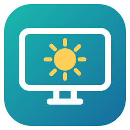

# ScreenLight 屏幕亮度调节



一个适用于 Windows 的轻量屏幕亮度工具，支持笔记本和外接显示器分别调节、自定义全局快捷键以及系统托盘运行。

支持 Windows 10 / 11。第一次使用请按下面的“开始使用”操作：下载源码需要安装 .NET 8 SDK 并编译；下载已经编译好的程序需要 .NET 8 Desktop Runtime。

本程序通过 Windows WMI 调节笔记本内置屏幕，通过 DDC/CI 调节外接显示器的真实背光。不使用遮罩变暗。启动时只读取当前亮度，不自动改变亮度。

## 开始使用

### 方式一：下载源码，自己编译并运行

#### 第 1 步：下载并解压源码

1. 打开 [ScreenLight 仓库首页](https://github.com/Sunym8/ScreenLight)。
2. 点击文件列表上方的绿色 **Code** 按钮，再点击 **Download ZIP**。
3. 下载完成后，右键 ZIP 文件，选择 **全部解压缩**。
4. 打开解压后的文件夹，继续进入里面的 `ScreenLight-main` 文件夹，直到能看到 **`BrightnessControl.csproj`** 文件。

这个文件夹就是“项目目录”。它大致包含下面这些文件：

```text
ScreenLight-main/
├── .github/
├── BrightnessControl.csproj   ← 找到这个文件，就进入了正确的目录
├── DisplayService.cs
├── MainForm.cs
├── Program.cs
└── README.md
```

源码刚解压时没有 `dist` 文件夹，这是正常的；第 5 步编译发布后才会生成它。

#### 第 2 步：安装 .NET 8 SDK

1. 打开[微软 .NET 8 官方下载页面](https://dotnet.microsoft.com/en-us/download/dotnet/8.0)。
2. 找到 **Build apps - SDK** 区域，选择 **Windows → x64** 安装程序。大多数使用 Intel / AMD 处理器的 Windows 电脑选 x64；使用 ARM 处理器的电脑选 Arm64。
3. 下载并完成安装。Windows 版 SDK 已包含编译工具和 .NET Desktop Runtime。

从源码编译需要 **SDK**；页面上的 **Desktop Runtime** 是给已经编译好的程序使用的。安装完成后再打开下一步的终端，以便终端识别新安装的 `dotnet` 命令。

#### 第 3 步：在项目目录打开终端

回到第 1 步找到的、**包含 `BrightnessControl.csproj` 的文件夹**：

- **Windows 11**：在文件夹空白处右键，选择 **在终端中打开**。
- **Windows 10**：按住 **Shift**，在文件夹空白处右键，选择 **在此处打开 PowerShell 窗口**。
- **通用方法**：点击文件资源管理器顶部的地址栏，输入 `powershell`，按 **Enter**。这会在当前文件夹打开 PowerShell。

这里需要在文件夹空白处操作。打开后，终端提示符中的路径应当指向刚才的项目目录。

#### 第 4 步：确认环境和目录正确

在终端依次复制下面两条命令，每条输入后按 **Enter**：

```powershell
dotnet --list-sdks
```

输出中应当包含一行 `8.0.xxx`，表示 .NET 8 SDK 已安装。

```powershell
dir .\BrightnessControl.csproj
```

这条命令应当列出 `BrightnessControl.csproj`。如果提示找不到该文件，回到文件资源管理器，进入包含它的文件夹，再按第 3 步重新打开终端。

#### 第 5 步：编译并生成可运行程序

在同一个终端复制下面这条完整命令，按 **Enter**：

```powershell
dotnet publish .\BrightnessControl.csproj -c Release --self-contained false -o .\dist
```

等待命令完成。成功时会看到类似 `ScreenLight -> ...\dist\` 的输出，同时项目目录下会新增 **`dist`** 文件夹。这条命令会完成编译和发布。

#### 第 6 步：运行并设置快捷键

1. 回到文件资源管理器，打开新生成的 **`dist`** 文件夹。
2. 双击 **`ScreenLight.exe`**。
3. 程序会读取当前屏幕亮度，检测成功后可以拖动亮度滑块。
4. 点击主窗口 **右上角的齿轮图标 → 快捷键**，点击组合键框，按下自己想用的快捷键，调整每次变化的百分比，然后点击 **保存并启用快捷键**。
5. 在 **设置 → 常规** 中，可以选择开机自启动，以及点击主窗口右上角 **×** 时是 **收起到托盘** 还是 **直接退出软件**，点击 **保存常规设置** 生效。默认不开机自启动，默认关闭窗口时收起到托盘。

以后使用时直接运行 `dist` 中的 `ScreenLight.exe` 即可。可以为它创建桌面快捷方式，并保留完整的 `dist` 文件夹。复制到其他电脑时也需要复制整个 `dist` 文件夹；目标电脑需要安装 .NET 8 Desktop Runtime。

### 方式二：下载已经编译好的程序

1. 打开[微软 .NET 8 官方下载页面](https://dotnet.microsoft.com/en-us/download/dotnet/8.0)，在 **Run apps - Runtime** 下找到 **.NET Desktop Runtime**，选择 Windows x64 并安装。已经安装对应 SDK 或 Desktop Runtime 的电脑可直接进入下一步。
2. 打开本仓库的 [Releases 最新版本页面](https://github.com/Sunym8/ScreenLight/releases/latest)。
3. 在版本说明下方的 **Assets** 区域下载 **`ScreenLight-v1.1.0-windows-x64.zip`**，以后的版本使用相同格式的文件名。
4. 将压缩包 **全部解压缩** 到一个固定的文件夹，例如 `D:\Apps\ScreenLight`。
5. 在解压后的文件夹中双击 **`ScreenLight.exe`**。这个包直接包含程序文件，不需要执行编译命令。
6. 点击主窗口 **右上角的齿轮图标**，进入设置修改快捷键、开机自启动和关闭窗口行为。

Releases 中 GitHub 自动生成的 **Source code (zip)** 和 **Source code (tar.gz)** 是源码包。如果下载了源码包，请按照“方式一”编译。要直接使用软件，请选择名称以 **`ScreenLight-`** 开头、以 **`windows-x64.zip`** 结尾的程序包。

更新版本时，先在旧版的托盘菜单中选择 **退出**，再将新程序包全部解压到原来的程序文件夹。快捷键和常规设置保存在用户目录中，可以继续使用。启用了开机自启动时，请保留程序的固定路径；如果移动了文件夹，打开新版 **设置 → 常规**，重新勾选开机自启动并保存。

#### 下载开发构建（可选）

每次推送代码后的编译结果也可以在 [Actions 页面](https://github.com/Sunym8/ScreenLight/actions)下载：登录 GitHub，打开一条 **Build Windows app / Success** 的运行记录，在下方 **Artifacts** 区域点击 **ScreenLight-windows**，全部解压后运行 `ScreenLight.exe`。

GitHub Actions 构建产物需要登录后下载，并且有保留期限；默认是 90 天。详见 [GitHub 下载构建产物说明](https://docs.github.com/en/actions/how-tos/manage-workflow-runs/download-workflow-artifacts)。

### 第一次使用常见问题

| 遇到的情况 | 处理方法 |
| --- | --- |
| 提示 `dotnet` 不是内部或外部命令，或无法识别 `dotnet` | 安装 .NET 8 SDK；安装后关闭原来的终端，按第 3 步重新打开。 |
| `dotnet --list-sdks` 没有列出 SDK | 从源码编译需要安装 SDK；仅安装 Desktop Runtime 只能运行成品程序。 |
| 提示找不到项目文件，或出现 `MSB1009` | 按第 3 步在包含 `BrightnessControl.csproj` 的文件夹打开终端，再执行编译命令。 |
| 下载源码后没有 `dist` 或 `ScreenLight.exe` | 完成第 5 步，编译发布成功后会生成它们。 |
| 双击程序后提示需要安装 .NET | 安装 .NET 8 **Desktop Runtime**，其架构应当与程序匹配；GitHub 自动构建的 Windows 版本使用 x64。 |
| 找不到刚关闭的程序窗口 | 在 Windows 系统托盘中找到 ScreenLight 图标，单击即可重新打开；图标可能在托盘的“显示隐藏图标”区域。 |
| 外接显示器被列出，但亮度不可调 | 在显示器实体菜单中检查 DDC/CI 是否开启，然后查看下面的“如果以后检测失败”。 |

## 已验证的设备

- 外接屏幕：SANC G7 Pro Max，DP 连接，DDC/CI 真实亮度控制正常。
- 笔记本内置屏幕：CMN1540，WMI 真实亮度控制正常。
- 两块屏幕均实测 100% → 95% → 100%，重新读取验证成功。
- 快捷键注册、重复快捷键拒绝及注销后重注册检查通过。
- 主界面和设置中的常规、快捷键、检测帮助页面已渲染检查。
- 开机自启动登记、设置保存失败时恢复原配置、两种关闭行为和启动到托盘均有集成验证。

## 默认快捷键

| 控制目标 | 提高亮度 | 降低亮度 |
| --- | --- | --- |
| 全部屏幕 | Ctrl + Alt + ↑ | Ctrl + Alt + ↓ |
| 外接屏幕 | Ctrl + Alt + Page Up | Ctrl + Alt + Page Down |
| 笔记本屏幕 | Ctrl + Alt + Shift + ↑ | Ctrl + Alt + Shift + ↓ |
| 鼠标所在屏幕（默认关闭） | Ctrl + Alt + Shift + Page Up | Ctrl + Alt + Shift + Page Down |

默认每次调节 5%，在 **右上角齿轮 → 设置 → 快捷键** 中可改为 1%–25%。点击组合键框，再按自己想用的组合键，最后点击“保存并启用快捷键”。取消勾选可以停用某项快捷键。

如果键盘把 Page Up / Page Down 放在 Fn 组合键上，需要按相应的 Fn 组合，或者在软件中换成更方便的快捷键。

## 常规设置

点击主窗口 **右上角的齿轮图标 → 常规**，更改后点击 **保存常规设置**。

- **开机自启动**：默认关闭。启用后，在当前用户登录 Windows 时自动启动到托盘，快捷键继续可用；取消勾选并保存后移除自启动登记。采用当前用户的启动项，无需管理员权限。
- **关闭窗口行为**：默认 **收起到托盘**，此时快捷键继续生效；也可以选择 **直接退出软件**，关闭时释放快捷键和托盘图标。
- **设置窗口的 ×**：只收起设置面板，不退出主程序。
- **托盘菜单的“退出”**：无论关闭行为如何配置，都完全退出软件。

重复启动会打开已有窗口。登录 Windows 时的自启动会读取当前亮度，不自动调整亮度。自启动需要保留完整程序文件夹，移动位置后应重新保存启动设置。

设置保存在 `%LOCALAPPDATA%\ScreenLight\settings.json`。不保存或自动恢复硬件亮度，以免覆盖显示器实体按键或笔记本 Fn 键的调整。通过快捷键调整时会先读取当前硬件值。

## Twinkle Tray 的排查结果

本项目起因是 Twinkle Tray 提示找不到兼容显示器。独立检测和实际读写验证发现，测试设备的 DDC/CI 与 WMI 接口均可正常工作。软件检测失败并不一定表示显示器不支持亮度调节，但本工具同样需要可用的硬件控制接口。

本程序不修改 Twinkle Tray 的设置、安装文件或快捷键。使用 ScreenLight 时建议先退出 Twinkle Tray，避免两者同时占用快捷键或发送显示器控制命令。

Twinkle Tray 官方排查说明：
https://github.com/xanderfrangos/twinkle-tray/wiki/Display-Detection-%26-Support-Issues

## 如果以后检测失败

点击主界面的“重新检测”。显示器插拔或休眠唤醒后也会自动检测。如果仍不可用，打开 **右上角齿轮 → 设置 → 检测与帮助** 查看错误信息，可导出 JSON 检测报告。

检查显示器菜单内 DDC/CI 是否开启、DP/HDMI 线材和连接是否正常，退出其他亮度控制软件，再尝试显示器断电重启或检查显卡驱动。接口失效时程序会说明错误，不会把失败的写入显示成成功。当前版本在接口可用的情况下工作，不能绕过失效的驱动或显示器 DDC/CI 开关。

克隆/镜像显示可能让多个物理屏幕共享一个桌面区域；这种情况下“鼠标所在屏幕”会调整该区域内所有可控制的物理屏幕。需要精确区分时建议使用扩展桌面。

## 技术说明与诊断命令

没有第三方 NuGet 包。代码通过系统 Win32 API 和 WMI COM 接口控制亮度。DDC 操作在后台串行执行，刷新时释放物理显示器句柄，避免旧句柄被重复使用。

GitHub Actions 会在推送后构建 Windows 版本，并附带本使用说明；推送匹配版本号的 `v*` 标签时还会打包并发布 Release。完整下载步骤见上面的“方式二”。

软件图标为本项目原创的“显示器＋太阳”设计。矢量源文件在 `Assets/ScreenLight.svg`，多尺寸 Windows 图标在 `Assets/ScreenLight.ico`，可在项目目录执行 `powershell -File .\tools\GenerateIcon.ps1` 重新生成。

下面的诊断和验证命令供排查问题时使用，日常启动只需双击程序。在包含 `BrightnessControl.csproj` 的项目目录中执行：

```powershell
.\dist\ScreenLight.exe --diagnose diagnostics.json
.\dist\ScreenLight.exe --self-test self-test.txt
.\dist\ScreenLight.exe --settings-check settings-verification.txt
.\dist\ScreenLight.exe --ui-check ui-preview.png
```

`--diagnose` 只读硬件，不改亮度；`--ui-check` 临时预览主界面和设置页面，不注册快捷键或修改亮度；`--self-test` 使用独立测试组合键验证注册和释放。`--settings-check` 使用临时设置文件及独立测试启动项验证设置持久化、保存失败恢复、关闭窗口与启动到托盘行为，完成后清理测试数据，不修改正式软件的自启动设置。WinExe 命令从 PowerShell 运行时可能异步返回，脚本中可使用 `Start-Process -Wait`。

另外提供 `--verify-hardware hardware-verification.json`，它会短暂改变每块屏幕的亮度并在 finally 中尝试恢复；正常使用不需要运行该命令。
